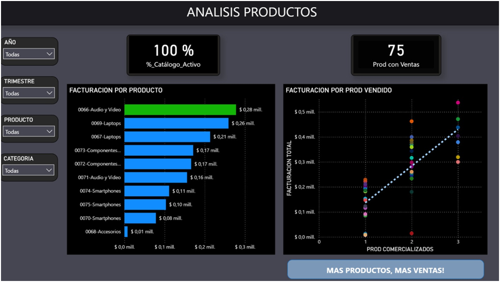

Capturas del dashboard desarrollado en Power BI.
# 📊 Dashboard – Power BI

El dashboard fue desarrollado en Power BI con el objetivo de analizar el desempeño comercial de la empresa y obtener información útil para la toma de decisiones.

Se desarrollaron tres páginas principales de análisis:

---

## 1. 📈 Resumen Ejecutivo

Esta página presenta una visión general del desempeño de la empresa.

### Segmentación

El dashboard permite analizar la información mediante filtros por:

- Año
- Trimestre
- Sucursal
- Categoría
- Forma de pago
- Cliente

### KPIs

Se utilizaron indicadores clave para obtener una visión rápida del negocio:

- Facturación
- Sucursales
- Unidades vendidas
- Transacciones
- Productos
- Empleados
- Clientes

### Principales insights

- La categoría **Laptops** se encuentra entre las categorías con mayor cantidad de ventas.
- La sucursal con mayor facturación es **Valencia**.

---

## 2. 🏢 Análisis de Sucursales

### Pregunta de negocio

> ¿Cuál es la sucursal que menos vende?

El primer análisis se realizó comparando la facturación de las diferentes sucursales.

El resultado mostró que **Buenos Aires es la sucursal con menor facturación**.

Sin embargo, para obtener una visión más completa del desempeño, se realizó un segundo análisis considerando la cantidad de ventas en relación con la cantidad de empleados.

### Análisis de eficiencia de ventas

Al analizar las ventas por empleado, se observó que **Madrid presenta el menor rendimiento en términos de eficiencia de ventas**.

### Conclusión

El análisis permitió diferenciar entre **volumen total de ventas y eficiencia de ventas**.

La menor facturación de Buenos Aires está relacionada con que esta sucursal cuenta con la **menor cantidad de empleados** respecto de las demás sucursales.

Por lo tanto, una menor cantidad de empleados se relaciona con una menor capacidad de generar ventas en términos absolutos.

Este análisis permitió evitar una interpretación basada únicamente en la facturación total y agregar una perspectiva relacionada con los recursos disponibles en cada sucursal.

---

## 3. 🛍️ Análisis de Productos

### Pregunta de negocio

> ¿Todo el catálogo se vende o existen productos considerados "fantasma"?

Se desarrolló un KPI para identificar si existían productos del catálogo que no registraran ventas.

### Resultado

El análisis mostró que **todos los productos del catálogo registraron al menos una venta**.

Por lo tanto, no se identificaron productos sin movimiento dentro del catálogo analizado.

### Ranking de productos

También se analizó el comportamiento de los productos mediante un **Top 10 de productos con mayor cantidad de ventas**.

Los principales resultados fueron:

- El producto más vendido pertenece a la categoría **Audio y Video**.
- El producto más vendido no corresponde a la categoría Laptops.
- El Top 10 concentra aproximadamente el **21 % del total de productos**.
- El producto ubicado en primer lugar registra aproximadamente **1,3 veces las ventas del producto ubicado en décimo lugar**.
- La diferencia relativamente reducida entre los primeros puestos indica un rendimiento similar entre los productos que integran el Top 10.
- La categoría **Laptops aparece con mayor frecuencia dentro del Top 10** que otras categorías.

### Conclusión

Las ventas no dependen exclusivamente de un pequeño grupo de productos. El Top 10 representa una proporción relativamente limitada del catálogo y presenta un rendimiento relativamente similar entre sus integrantes.

Esto sugiere una distribución de ventas más amplia dentro del catálogo.

---

## 🔎 Relación entre proveedores y ventas

Como análisis adicional, se utilizó un gráfico de dispersión para estudiar la relación entre:

- Cantidad de productos ofrecidos por un proveedor.
- Cantidad de ventas.

### Resultado

Se observa una **asociación positiva** entre la cantidad de productos que ofrece un proveedor y el volumen de ventas.

Es decir, los proveedores que cuentan con un catálogo más amplio tienden a presentar mayores niveles de ventas.

> ⚠️ Esta relación representa una asociación observada en los datos y no implica necesariamente una relación causal.

---

## 📷 Visualizaciones del Dashboard

### Resumen Ejecutivo

### Análisis de Sucursales

### Análisis de Productos

